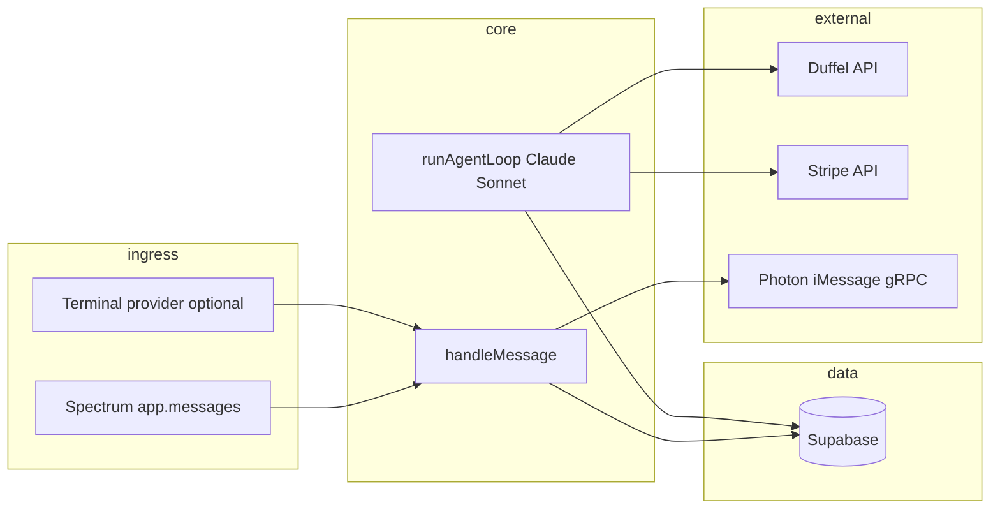

# remiText — project context

This document describes the **remiText** codebase as it exists today: purpose, architecture, data model (as implied by code), integrations, configuration, and file layout. Use it to onboard humans or AI agents working in this repository.

---

## What it is

**remiText** is a **long-running Node.js service** that powers **Remi**, an AI travel concierge exposed over **SMS / iMessage** (via [Spectrum](https://spectrum-ts) and Photon’s iMessage stack). Users text naturally; the app **onboards** new users into Supabase, runs an **Anthropic Claude** agent with **tools** for flight search and booking (**Duffel**), charges cards through **Stripe**, and persists conversation and booking state in **Supabase**.

There is **no web UI in this repo** for the chat itself. A separate signup site (`SIGNUP_URL_BASE` / default `https://remitexts.co/signup`) collects payment methods and links users by phone query param.

---

## High-level architecture



1. **`src/index.ts`** boots **Spectrum** with either `imessage` or `terminal` provider, optionally binds an HTTP **health** listener on `PORT`, asserts Supabase `seen_messages` exists, then **async-iterates** `app.messages` and dispatches each inbound message to **`handleMessage`** inside `space.responding()`.
2. **`handleMessage`** dedupes by message id, marks the chat read via Photon, resolves the sender to a **contact key** (E.164 / email / opaque id), loads or creates the user, then either runs **onboarding** or the **Claude tool loop**.
3. **Claude** uses **Duffel** for offers, holds, and instant-paid orders; **Stripe** for off-session charges against a saved payment method (**SPT** = saved payment method id on the user).

---

## Runtime stack

| Piece | Role |
|--------|------|
| **TypeScript** (ES modules, `Node16` resolution) | Source under `src/`; build output in `dist/`. |
| **`tsx`** | Dev runner (`npm run dev`). |
| **`spectrum-ts`** | Messaging abstraction: `Spectrum`, `imessage` / `terminal` providers, `cloud.issueImessageTokens`. |
| **`@photon-ai/advanced-imessage`** | gRPC client to Photon’s iMessage relay; used here for **`markRead(spaceId)`** only (sending/replies go through Spectrum). |
| **`@anthropic-ai/sdk`** | `messages.create` with tools, model **`claude-sonnet-4-6`**. |
| **`@duffel/api`** | Flight offer requests, orders, pay-from-balance, etc. |
| **`stripe`** | `PaymentIntents` off-session using saved PM + customer. |
| **`@supabase/supabase-js`** | Service-role client (server only; never expose key to clients). |
| **`dotenv`** | Loads `.env` at process start. |

**Note:** `express` is listed in `package.json` but **not imported** by current `src/` code. It may be leftover or reserved for future HTTP routes.

---

## Entrypoint and providers

- **`SPECTRUM_PROVIDER`**: `imessage` (default) or `terminal` for local testing without iMessage.
- **Spectrum auth**: `PROJECT_ID`, `PROJECT_SECRET` (required).
- **Optional health server**: If `PORT` is a positive number, `GET /` returns plain `ok` on `0.0.0.0`.

---

## Message pipeline (`src/handlers/message.ts`)

1. **Dedupe**: Insert message `id` into `seen_messages`. Unique violation → skip handling (already processed, including across processes).
2. **Mark read**: `markRead(space.id)` on the Photon advanced client (chat GUID from Spectrum; **not** normalized the same way as phone lookup).
3. **Sender**: Inbound uses `message.sender?.id ?? space.id`. A **canonical contact key** is derived via **`normalizeContactKey`** (`src/utils/contactId.ts`): strips Photon-style chat prefixes (`iMessage;-;`, `SMS;-;`, `any;-;`, etc.), lowercases emails, normalizes plausible phone strings to **E.164** (default country `DEFAULT_PHONE_COUNTRY_CODE` or `1`), leaves opaque ids alone.
4. **User lookup**: `getUserByPhone` tries normalized key then raw trimmed (legacy rows).
5. **No user** → **onboarding** (`onboarding_sessions` + prompts) or start new onboarding under canonical phone.
6. **User exists** → append user message to `conversations`, **`runAgentLoop`**, strip markdown for bubbles (`stripMarkdown`), append assistant reply, **`message.reply`**.

Logging intentionally avoids full message bodies (lengths / ids / user id).

---

## Onboarding (`src/services/onboarding.ts`)

Separate Supabase client (same URL + service role). Steps stored on **`onboarding_sessions`**: name → email → DOB (YYYY-MM-DD) → title (Mr/Ms/Mrs/Miss) → passport (or “skip”). On completion, inserts **`users`** with **`phone`** set to **`normalizeContactKey(latest.phone)`** and deletes the session row. Collisions with existing user fall back to fetch-by-phone.

---

## AI agent (`src/ai/claude.ts`, `src/ai/tools.ts`)

- **System prompt**: Remi as concise SMS/iMessage concierge; plain text; relative dates; HOLD vs BOOK semantics; tool routing; formatting rules (use Duffel `formatted` fields verbatim where specified).
- **Context**: Last ~40 `conversations` rows; optional block from **`last_flight_search`** on the user (summarized offers + search params + raw offer request for refreshes).
- **Relative dates**: `resolveRelativeDates` may append a clarification line to the system prompt when the user message contained relative phrasing.

### Tools (executed in-process)

| Tool | Purpose |
|------|---------|
| **`search_flights`** | Duffel offer request; saves **`last_flight_search`** on user; returns SMS-formatted string + offer list JSON for the model. |
| **`hold_flight`** | Pay-later hold when allowed; else **`OfferRequiresInstantPaymentError`** → model asks to BOOK. Validates `offer_id` against last search when offers exist. On success sets **`pending_*`** fields and clears `last_flight_search`. Stale offers can trigger automatic re-search. |
| **`book_flight`** | Requires **`stripe_spt_id`**; prices offer; **charges Stripe** then **instant Duffel order**; refunds Stripe if Duffel fails after charge. Clears pending / last search on success. |
| **`confirm_booking`** | Pays for an **existing held** order from balance after Stripe charge (uses `pending_order_*` on user if tool args omit ids). |

Offer allowlisting: if `last_flight_search.offers` is non-empty, hold/book **`offer_id`** must appear in that list (prevents arbitrary id use).

---

## Duffel (`src/services/duffel.ts`)

- **`searchFlights`**: Creates offer request, maps up to **5** offers into internal `FlightOffer` type, logs serialized API payload.
- **`holdOrder`**, **`bookOrderInstant`**, **`getOfferPricing`**, **`payForOrderWithBalance`**: booking lifecycle; instant vs pay-later behavior encoded in Duffel responses/errors.
- **`OfferRequiresInstantPaymentError`**: Structured path when hold is not allowed.

---

## Stripe (`src/services/stripe.ts`)

- **`chargeViaSPT`**: Retrieves PM if needed to resolve **customer**, creates **confirmed** PaymentIntent **off_session**.
- **`refundPaymentIntent`**: Used when Duffel booking fails after a successful charge.

---

## Supabase (`src/services/supabase.ts`)

Uses **service role** key (full access). Functions:

- **`assertSeenMessagesTableReady`**: Startup check for `seen_messages`.
- **`claimMessage`**, **`getUserByPhone`**, **`getConversationHistory`**, **`appendMessage`**
- **`setLastFlightSearch`**, **`clearLastFlightSearch`**
- **`setPendingOrder`**, **`clearPendingOrder`**

### Tables (from code paths)

| Table | Usage |
|--------|--------|
| **`seen_messages`** | `id` (text PK) — message id dedupe. Migration: `supabase/migrations/20250511000000_create_seen_messages.sql`. |
| **`users`** | Profile, `stripe_customer_id`, `stripe_spt_id`, `last_flight_search` (JSON), pending order columns, etc. See **`src/types.ts`** `UserProfile`. |
| **`conversations`** | `user_id`, `role`, `content`, `created_at` (ordering). |
| **`onboarding_sessions`** | Row per onboarding phone with `step` and collected fields. |

**Important:** Other columns and RLS policies are **not defined in this repo**; they live in your Supabase project. Apply the bundled migration (and any others you maintain) to match production.

---

## iMessage / Photon (`src/services/imessage.ts`)

- gRPC **address**: `SPECTRUM_IMESSAGE_ADDRESS` or default `imessage.spectrum.photon.codes:443`.
- Tokens from **`cloud.issueImessageTokens(PROJECT_ID, PROJECT_SECRET)`**, cached until near expiry.
- **`markRead`**: `getClient().chats.markRead(spaceId)`.

Photon / iMessage **skills** for agents live under **`.agents/skills/imessage/`** (installed via `npx skills add …`) and are symlinked from **`.cursor/skills/imessage/SKILL.md`** for Cursor.

---

## Pricing (`src/utils/pricing.ts`)

Markup / fee logic for what you charge vs Duffel base price, driven by env vars such as:

- `REMI_MARKUP_FLAT_CENTS`, `REMI_BOOKING_FEE_CENTS`, `REMI_MARKUP_PERCENT`
- `REMI_PRICING_MODE` (e.g. `ota`)
- `REMI_OTA_PERCENT`, `REMI_OTA_MIN_ADD_CENTS`, `REMI_ROUND_TO_DOLLAR`

Used when computing amounts for Stripe / user-facing totals.

---

## Configuration (environment variables)

| Variable | Required? | Purpose |
|----------|-----------|---------|
| `PROJECT_ID` | Yes | Spectrum project id. |
| `PROJECT_SECRET` | Yes | Spectrum project secret. |
| `SUPABASE_URL` | Yes | Supabase project URL. |
| `SUPABASE_SERVICE_ROLE_KEY` | Yes | Server-side Supabase access. |
| `ANTHROPIC_API_KEY` | Yes | Claude API. |
| `DUFFEL_API_KEY` | Yes | Duffel API token. |
| `STRIPE_SECRET_KEY` | Yes | Stripe secret key. |
| `SPECTRUM_PROVIDER` | No | `imessage` (default) or `terminal`. |
| `PORT` | No | If set and valid, health HTTP server. |
| `SPECTRUM_IMESSAGE_ADDRESS` | No | Photon gRPC host:port. |
| `SIGNUP_URL_BASE` | No | Card collection page base URL. |
| `DEFAULT_PHONE_COUNTRY_CODE` | No | E.164 normalization default (default `1`). |
| `REMI_*` | No | Pricing / markup (see `pricing.ts`). |

---

## Scripts and build

| Command | Description |
|---------|-------------|
| `npm run dev` | Run `src/index.ts` with `tsx`. |
| `npm run build` | `tsc` → `dist/`. |
| `npm start` | `node dist/index.js` (requires prior build). |

---

## Repository layout

```
remiText/
├── PROJECT_CONTEXT.md          # This file
├── package.json
├── tsconfig.json
├── supabase/migrations/        # SQL migrations (e.g. seen_messages)
├── .agents/skills/imessage/    # Photon iMessage agent skill (SKILL.md)
├── .cursor/skills/imessage/    # Symlink to skill for Cursor
└── src/
    ├── index.ts                # Spectrum bootstrap + message loop
    ├── handlers/message.ts     # Dedupe, read receipt, onboarding vs agent
    ├── ai/
    │   ├── claude.ts           # System prompt, tool loop, executeTool
    │   └── tools.ts            # Anthropic tool schemas
    ├── services/
    │   ├── supabase.ts
    │   ├── onboarding.ts
    │   ├── imessage.ts         # Photon markRead
    │   ├── duffel.ts
    │   └── stripe.ts
    ├── types.ts
    └── utils/                  # contactId, stripMarkdown, flights, dates, errors, signup URL, pricing
```

---

## Operational notes

- **Service role key**: Treat like root database access; run only on trusted servers.
- **Dedupe**: Depends on stable message ids from Spectrum; duplicate inserts are ignored by design.
- **Refunds**: If Stripe refund fails after a Duffel failure, logs call out **manual review** with payment intent and user id.
- **Model / tool logging**: Tool names and inputs are logged; keep log aggregation access restricted in production.

---

## Related assets outside this repo

- **Signup / card capture**: Default `https://remitexts.co/signup?phone=…` (override with `SIGNUP_URL_BASE`). That app must sync Stripe customer + payment method ids back into **`users`** for booking to work.

This file reflects the **code in this repository only**; infrastructure (hosting, process manager, secrets injection) is deployment-specific.
